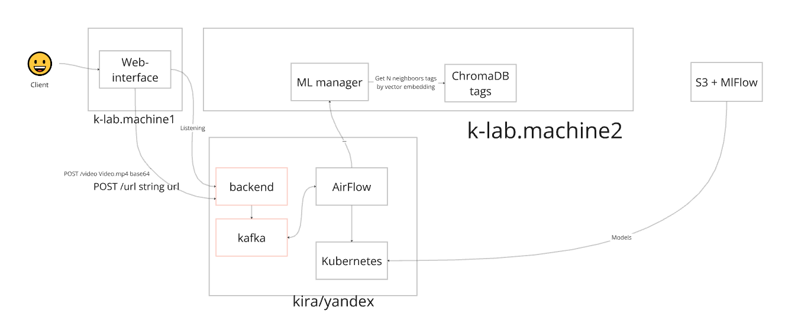
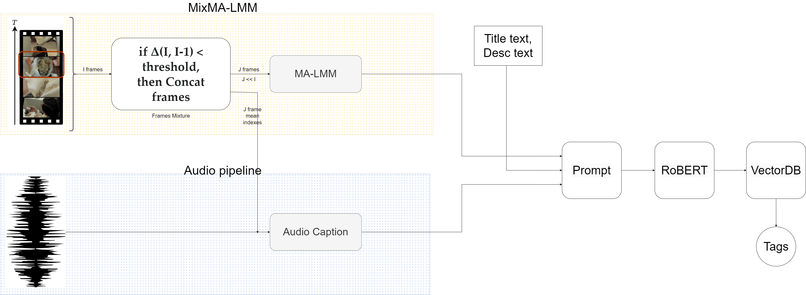
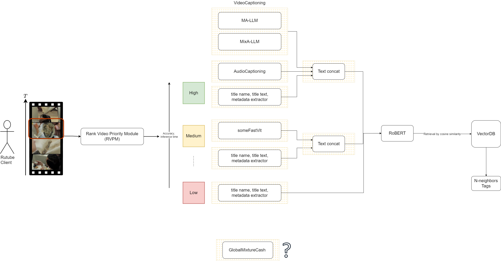

# wiki
Проект содержит репозитории для решения хакатона Цифровой прорыв по кейсу "Генерация тегов для видео"

# Состав команды
- ML, Speech — Далер Хомидов 🎩
- Teamlead, ML  — Жданов Александр 🐱
- Backend, MLOps — Вебер Артем-Дариус 🔬
- Frontend — Журавлев Артем 🍺
- Дизайн презентаций и фронтенда — Венедиктова Илона 🐥

# Билд
См. по репозиториям

# Тизер
В решении предлагается:
- Video captioning и Audio captioning для получения текста с видео по таймкодам
- Алгоритм миксования фреймов с целью сохранения семантики действия во фреймах через имитацию выдержки (см. [MixMA-LMM](https://github.com/381c9fba/mixMA-LMM))
- Концепт масштабирования обработки (см. ниже)
- Рабочий системный дизайн с применением Airflow/Mlflow/S3

# Системный дизайн

# Пайплайн обработки видео для тегирования

# Концепт масштабирования обработки

